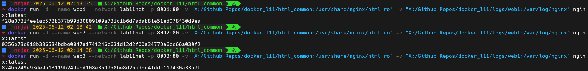
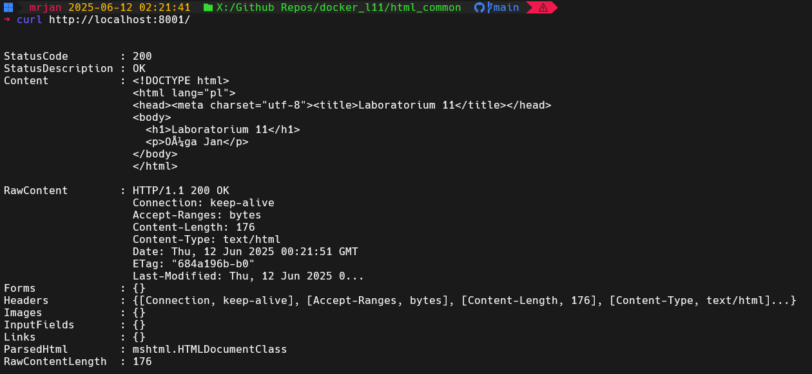
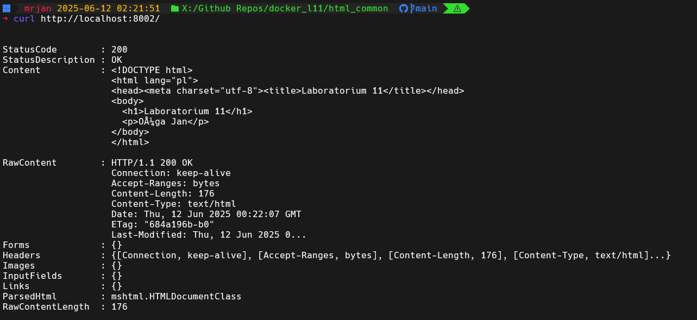
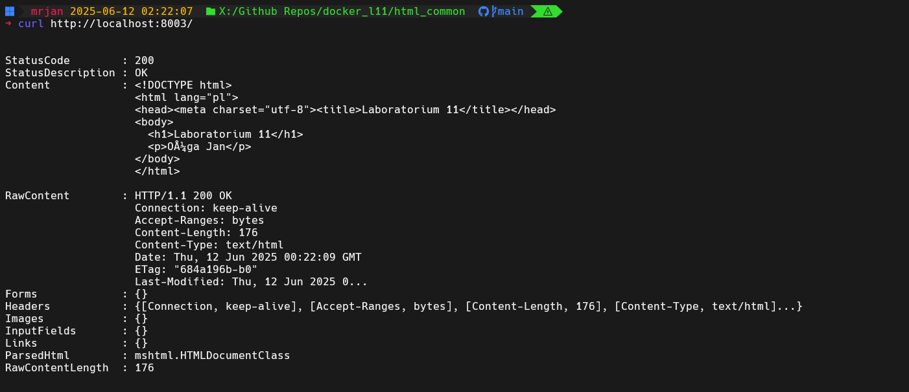

# Laboratorium 11 - Docker Nginx Containers
## Autor: Jan Ożga

## Opis zadania
Uruchomienie trzech kontenerów Docker z serwerami Nginx w sieci.

## Strona w HTML
```html
<!DOCTYPE html>
<html lang="pl">
<head><meta charset="utf-8"><title>Laboratorium 11</title></head>
<body>
  <h1>Laboratorium 11</h1>
  <p>Ożga Jan</p>
</body>
</html>
```

## Polecenie użyte do utworzenia sieci
```bash
docker network create lab11net
```

## Uruchomienie kontenerów


## Potwierdzenie działania dostępności stron



